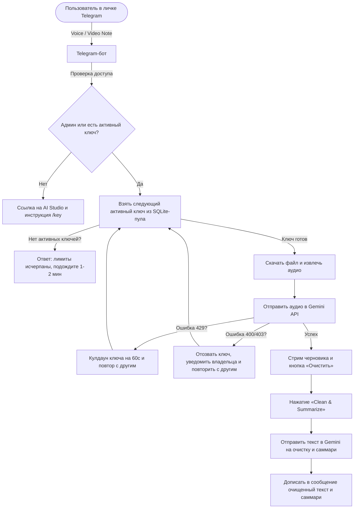

# Telegram Voice STT & Summary Bot

[](LICENSE)

Асинхронный Telegram-бот для быстрой расшифровки голосовых сообщений и видео-кружочков через Gemini API, с краудсорсинговым пулом API-ключей и очисткой текста с саммари по кнопке.

## Особенности

- Тихий режим — бот игнорирует обычные текстовые сообщения и медиа в личных чатах; в группах не отвечает вовсе
- Общий пул ключей («казна») — доступ открывается, когда пользователь добавляет свой бесплатный ключ Gemini через `/key <ключ>`; все ключи используются по кругу (round-robin)
- Отказоустойчивость — при ошибке 429 ключ уходит в 60-секундный кулдаун и запрос повторяется с другим ключом; при 400/403 ключ отзывается, владельцу приходит уведомление в личку, а запрос тоже повторяется с другим ключом
- Модели заданы статически через `.env` (`GEMINI_MODEL`, `GEMINI_SUMMARY_MODEL`) — без переключения из интерфейса
- Асинхронная архитектура на `aiogram` + `aiohttp`, прямые REST-запросы к Gemini без лишних обёрток
- Потоковый вывод расшифровки в реальном времени через нативные черновики Telegram (`sendMessageDraft`) с фолбэком на редактирование сообщения
- Расшифровка с паузами (`...`) и невербальными звуками в квадратных скобках (например, `[sighs]`, `[laughs]`)
- Очистка текста и саммари по кнопке — расшифровка приходит сразу, кнопка «Clean & Summarize» убирает слова-паразиты (сохраняя сленг и тон) и добавляет структурированную выжимку
- Игнорирует голосовые и видео-кружочки, отправленные в ответ на сообщение бота, — можно спокойно перезаписать чистовик в том же чате
- Хардened Docker-образ: read-only контейнер, непривилегированный пользователь, volume для базы ключей

## Требования

- Docker и Docker Compose v2 (либо Python 3.10+ и `ffmpeg` локально)
- Токен Telegram-бота от [@BotFather](https://t.me/BotFather)
- Ключ Google Gemini API из [Google AI Studio](https://aistudio.google.com/)

## Быстрый старт

1. Клонируйте репозиторий:

   ```bash
   git clone https://github.com/renkagod/tg-voice-stt.git
   cd tg-voice-stt
   ```

2. Настройте окружение:

   ```bash
   cp .env.example .env
   # TELEGRAM_TOKEN, GEMINI_API_KEY, ALLOWED_USERS
   ```

3. Запуск:

   ```bash
   docker compose up -d --build
   ```

Локально без Docker: `pip install -r requirements.txt`, затем `python main.py` (нужен установленный `ffmpeg`).

## Команды

| Команда | Описание |
|---------|----------|
| `/start`, `/help` | Инструкция по получению ключа Gemini и использованию бота |
| `/key <ключ>` | Проверить и добавить ключ Gemini в пул, активировать доступ |
| `/key` | Статистика пула (активные ключи, кулдаун) и список своих ключей |
| `/revoke` | Отозвать все свои ключи и приостановить доступ к боту |

## Конфигурация (`.env`)

| Переменная | Обязательна | Описание |
|------------|--------------|----------|
| `TELEGRAM_TOKEN` | да | Токен бота от @BotFather |
| `GEMINI_API_KEY` | нет | Базовый ключ, которым «казна» засевается при старте; без него пул стартует пустым и работает только за счёт ключей, добавленных через `/key` |
| `ALLOWED_USERS` | нет | ID администраторов через запятую — доступ без своего ключа |
| `GEMINI_MODEL` | нет | Модель для расшифровки (по умолчанию `gemini-3.5-flash-lite`) |
| `GEMINI_FALLBACK_MODEL` | нет | Резервная модель при ошибках основной (по умолчанию `gemini-3.5-flash-lite`) |
| `GEMINI_SUMMARY_MODEL` | нет | Модель для очистки текста и саммари (по умолчанию `gemini-3.5-flash-lite`) |
| `DB_PATH` | нет | Путь к SQLite базе пула ключей (по умолчанию `data/keys.db`) |

## Docker

`docker-compose.yml` запускает контейнер с `read_only: true` и `tmpfs` на `/tmp`; SQLite-база пула ключей хранится в именованном volume `bot_data` (`/app/data`) и переживает пересборку контейнера. Включён `no-new-privileges`, процесс бота работает от непривилегированного пользователя (см. `Dockerfile`).

```bash
docker compose up -d --build   # запуск
docker compose logs -f         # логи
docker compose down            # остановка (volume bot_data сохраняется)
```

## Архитектура



## Ограничения

- Файлы больше 20 МБ бот не скачивает — таково ограничение Telegram Bot API для ботов
- `GEMINI_API_KEY` не проверяется онлайн при старте (в отличие от ключей, добавляемых через `/key`) — о его невалидности станет известно только при первом запросе к Gemini

## Лицензия

[MIT](LICENSE) — Copyright (c) 2026 [renkagod](https://github.com/renkagod).
