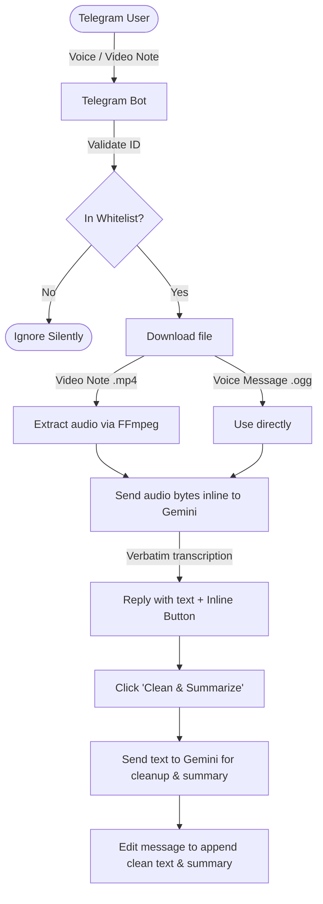

# Telegram Voice STT & Summary Bot

[](LICENSE)

An asynchronous, lightweight Telegram bot utility for high-speed transcription of voice messages and video notes ("circles") using Google Gemini API, with a one-click inline button to clean up filler words and generate summaries.

## Features

| Feature | Description |
|---------|-------------|
| **Silent Mode** | Ignores all text and media messages, responding only to voice and video notes. |
| **Security Whitelist** | Restricts access to a set of pre-approved Telegram User IDs. Non-whitelisted users are silently ignored. |
| **Low Latency** | Built on fully asynchronous Python (`aiogram` + `aiohttp`) with direct REST calls to Gemini to avoid library overhead. |
| **Smart Summary** | Verbatim transcription is sent immediately. An inline button triggers Gemini to clean up filler words (e.g., "uh", "um", "like") and format a structured summary. |
| **Hardened Docker** | Read-only container root filesystem with memory-based `tmpfs` for temporary audio storage. |

## Architecture



## Quick Start

### 1. Clone the Repository
```bash
git clone https://github.com/renkagod/tg-voice-stt.git
cd tg-voice-stt
```

### 2. Requirements
- Docker and Docker Compose v2 (or Python 3.10+ and FFmpeg installed locally)
- A Telegram Bot Token (from [@BotFather](https://t.me/BotFather))
- A Google Gemini API Key (from [Google AI Studio](https://aistudio.google.com/))

### 3. Configuration
Copy the template `.env.example` file and fill in your variables:

```bash
cp .env.example .env
```

Edit the `.env` file:
```ini
TELEGRAM_TOKEN=your_telegram_bot_token
GEMINI_API_KEY=your_gemini_api_key
ALLOWED_USERS=123456789,987654321
GEMINI_MODEL=gemini-2.5-flash
```

### 4. Deploy via Docker Compose

Build and run the bot in a hardened, non-privileged, read-only Docker container:

```bash
docker compose up -d --build
```

To view the logs:
```bash
docker compose logs -f
```

To stop the bot:
```bash
docker compose down
```

### 5. Manual Deployment (Local)

1. Install local dependencies:
   ```bash
   pip install -r requirements.txt
   ```
2. Make sure `ffmpeg` is installed and added to your system's PATH.
3. Start the bot:
   ```bash
   python main.py
   ```

## Configuration Reference

| Environment Variable | Description | Default |
|----------------------|-------------|---------|
| `TELEGRAM_TOKEN` | Telegram Bot Token from @BotFather | *Required* |
| `GEMINI_API_KEY` | API Key from Google AI Studio | *Required* |
| `ALLOWED_USERS` | Comma-separated list of approved Telegram User IDs | *Required* |
| `GEMINI_MODEL` | The Google Gemini model to use for STT and editing | `gemini-2.5-flash` |

## License

[MIT](LICENSE) — Copyright (c) 2026 [renkagod](https://github.com/renkagod).

---

## Русский

**Telegram Voice STT & Summary Bot** — это асинхронный утилитарный Telegram-бот на Python для сверхбыстрой расшифровки голосовых сообщений и видео-сообщений («кружочков») с помощью Gemini API.

### Возможности

- **Тихий режим (No Chatbot):** Бот полностью игнорирует текстовые сообщения и реагирует исключительно на голосовые (voice) и кружочки (video_note).
- **Безопасность (Whitelist):** Белый список разрешенных Telegram ID в `.env`. Сообщения от посторонних пользователей полностью игнорируются (без ответа).
- **Минимальная задержка:** Использование асинхронного `aiogram` и прямых REST-запросов к Gemini без лишних оберток.
- **Умное саммари:** Бот сразу присылает дословный текст сообщения, под которым находится инлайн-кнопка «✨ Clean & Summarize». При нажатии на неё бот редактирует сообщение, убирая из текста все слова-паразиты (`эээ`, `ну`, `в общем`), восстанавливает связность речи и выводит краткую выжимку (саммари) списком.
- **Безопасный Docker:** Запуск в read-only контейнере от имени несигнатурного пользователя с записью временных аудиофайлов в оперативную память (`tmpfs`).

### Быстрый старт

#### 1. Клонирование репозитория
```bash
git clone https://github.com/renkagod/tg-voice-stt.git
cd tg-voice-stt
```

#### 2. Требования
- Docker и Docker Compose v2 (или Python 3.10+ и установленный FFmpeg локально)
- Токен Telegram-бота (от [@BotFather](https://t.me/BotFather))
- Ключ Google Gemini API (от [Google AI Studio](https://aistudio.google.com/))

#### 3. Настройка
Скопируйте шаблон `.env.example` в `.env` и настройте переменные:
```bash
cp .env.example .env
```

Отредактируйте файл `.env`:
```ini
TELEGRAM_TOKEN=ваш_токен_телеграм
GEMINI_API_KEY=ваш_ключ_gemini
ALLOWED_USERS=123456789,987654321
GEMINI_MODEL=gemini-2.5-flash
```

#### 4. Запуск через Docker Compose

Соберите и запустите бота в защищенном read-only Docker-контейнере:

```bash
docker compose up -d --build
```

Просмотр логов:
```bash
docker compose logs -f
```

Остановка бота:
```bash
docker compose down
```

#### 5. Локальный запуск (без Docker)

1. Установите зависимости:
   ```bash
   pip install -r requirements.txt
   ```
2. Убедитесь, что `ffmpeg` установлен в вашей системе и добавлен в PATH.
3. Запустите бота:
   ```bash
   python main.py
   ```

### Справка по конфигурации

| Переменная окружения | Описание | Значение по умолчанию |
|----------------------|----------|-----------------------|
| `TELEGRAM_TOKEN` | Токен Telegram-бота | *Обязательно* |
| `GEMINI_API_KEY` | Ключ Gemini API | *Обязательно* |
| `ALLOWED_USERS` | Список разрешенных Telegram ID через запятую | *Обязательно* |
| `GEMINI_MODEL` | Модель Google Gemini для STT и редактирования | `gemini-2.5-flash` |

### Лицензия

[MIT](LICENSE) — Copyright (c) 2026 [renkagod](https://github.com/renkagod).
