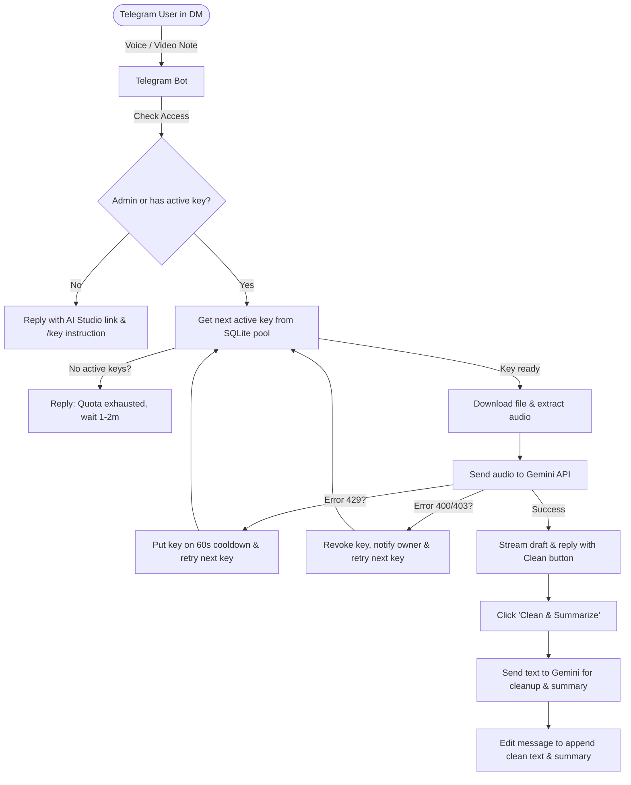

# Telegram Voice STT & Summary Bot

[](LICENSE)

An asynchronous, lightweight Telegram bot utility for high-speed transcription of voice messages and video notes ("circles") using Google Gemini API, with a crowdsourced API key pool ("Shared Treasury") and a one-click inline button to clean up filler words and generate summaries.

## Features

| Feature | Description |
|---------|-------------|
| **Silent Mode** | Ignores regular text and media in private chats. Group messages are ignored completely. |
| **Shared Key Pool (Crowdsourcing)** | Open access: users submit their free Gemini API key via `/key <key>` to unlock bot access. All valid keys are rotated (round-robin) across all bot users. |
| **Failover & Key Health** | Transparent failover: on rate limit (429), key is placed on a 60s cooldown; on fatal errors (400/403), key is revoked, owner is notified in DM, and the request is transparently retried with another key. |
| **Static Model Config** | Models are configured strictly via `.env` (`GEMINI_MODEL`, `GEMINI_SUMMARY_MODEL`), eliminating complex UI switching. |
| **Low Latency** | Built on fully asynchronous Python (`aiogram` + `aiohttp`) with direct REST calls to Gemini to avoid library overhead. |
| **Native Streaming** | Streams transcription updates in real-time using Telegram's native draft mechanism (`sendMessageDraft`) with safe rate-limited fallback. |
| **High Fidelity STT** | Transcribes audio with pauses formatted as `...` and non-verbal actions (e.g. `[sighs]`, `[laughs]`) in brackets. |
| **Smart Summary** | Verbatim transcription is sent immediately. An inline button triggers Gemini to clean up filler words (preserving slang, tone, and vocabulary) and format a structured summary. |
| **Reply Bypass** | Ignores voice/video notes sent in reply to the bot's messages, allowing you to read the cleaned text and record a new clean voice track in the same chat. |
| **Hardened Docker** | Read-only container root filesystem with memory-based `tmpfs` and mounted SQLite volume (`./data:/app/data`) for key persistence. |

## Architecture



## Commands

- `/start` or `/help` — Instructions on getting a Gemini key and using the bot.
- `/key <your_key>` — Validate, add a Gemini API key to the pool, and activate access.
- `/key` — View pool statistics (active keys, keys on cooldown) and your registered keys.
- `/revoke` — Revoke all your keys from the pool and suspend bot access.

## Quick Start

### 1. Clone the Repository
```bash
git clone https://github.com/renkagod/tg-voice-stt.git
cd tg-voice-stt
```

### 2. Requirements
- Docker and Docker Compose v2 (or Python 3.10+ and FFmpeg installed locally)
- A Telegram Bot Token (from [@BotFather](https://t.me/BotFather))
- A Google Gemini API Key (from [Google AI Studio](https://aistudio.google.com/))

### 3. Configuration
Copy the template `.env.example` file and fill in your variables:

```bash
cp .env.example .env
```

Edit the `.env` file:
```ini
TELEGRAM_TOKEN=your_telegram_bot_token
GEMINI_API_KEY=your_gemini_api_key
ALLOWED_USERS=123456789,987654321
GEMINI_MODEL=gemini-3.5-flash-lite
```

### 4. Deploy via Docker Compose

Build and run the bot in a hardened, non-privileged, read-only Docker container:

```bash
docker compose up -d --build
```

To view the logs:
```bash
docker compose logs -f
```

To stop the bot:
```bash
docker compose down
```

### 5. Manual Deployment (Local)

1. Install local dependencies:
   ```bash
   pip install -r requirements.txt
   ```
2. Make sure `ffmpeg` is installed and added to your system's PATH.
3. Start the bot:
   ```bash
   python main.py
   ```

## Configuration Reference

| Environment Variable | Description | Default |
|----------------------|-------------|---------|
| `TELEGRAM_TOKEN` | Telegram Bot Token from @BotFather | *Required* |
| `GEMINI_API_KEY` | Base system Gemini API Key seeded into the pool | *Required* |
| `ALLOWED_USERS` | Comma-separated list of Admin Telegram IDs (access without key) | *Required* |
| `GEMINI_MODEL` | Gemini model for STT | `gemini-3.5-flash-lite` |
| `GEMINI_FALLBACK_MODEL` | Fallback model when primary hits rate limits | `gemini-3.5-flash-lite` |
| `GEMINI_SUMMARY_MODEL` | Text model used for the Clean & Summarize action | `gemini-3.5-flash-lite` |
| `DB_PATH` | Path to SQLite database for the key pool | `data/keys.db` |

## License

[MIT](LICENSE) — Copyright (c) 2026 [renkagod](https://github.com/renkagod).

---

## Русский

**Telegram Voice STT & Summary Bot** — это асинхронный утилитарный Telegram-бот на Python для сверхбыстрой расшифровки голосовых сообщений и видео-сообщений («кружочков») с помощью Gemini API и краудсорсинговой модели пула ключей.

### Возможности

- **Тихий режим (No Chatbot):** Бот полностью игнорирует посторонние текстовые сообщения и реагирует исключительно на голосовые (voice), кружочки (video_note) и команды `/key`, `/revoke`. Группы полностью игнорируются (работа только в личке).
- **Краудсорсинговый пул ключей («Общая казна»):** Чтобы пользоваться ботом, пользователь добавляет свой бесплатный ключ Google Gemini через `/key <ключ>`. Все ключи объединяются в пул и честно распределяют нагрузку (Round-Robin).
- **Отказоустойчивость:** При ошибке 429 ключ уходит в кулдаун на 60 секунд, а запрос подхватывается следующим ключом. При 400/403 ключ отзывается, владельцу отправляется уведомление в ЛС, а войс расшифровывается другим ключом.
- **Статическая настройка моделей:** Модели задаются в `.env`, лишние инлайн-кнопки переключения убраны.
- **Администраторы:** Пользователи из `ALLOWED_USERS` имеют доступ к боту без необходимости привязки личного ключа.
- **Нативный стриминг:** Вывод текста в реальном времени через черновики Telegram (`sendMessageDraft`).
- **Умное саммари:** Инлайн-кнопка «✨ Clean & Summarize» очищает слова-паразиты и выводит структурированную выжимку.
- **Безопасный Docker:** Read-only контейнер с томом `./data:/app/data` для постоянного сохранения SQLite-базы ключей.

### Команды

- `/start` или `/help` — Справка и ссылка на получение ключа.
- `/key <ключ>` — Проверить и добавить API-ключ в казну.
- `/key` — Состояние казны и список своих ключей.
- `/revoke` — Отозвать все свои ключи и закрыть доступ.
